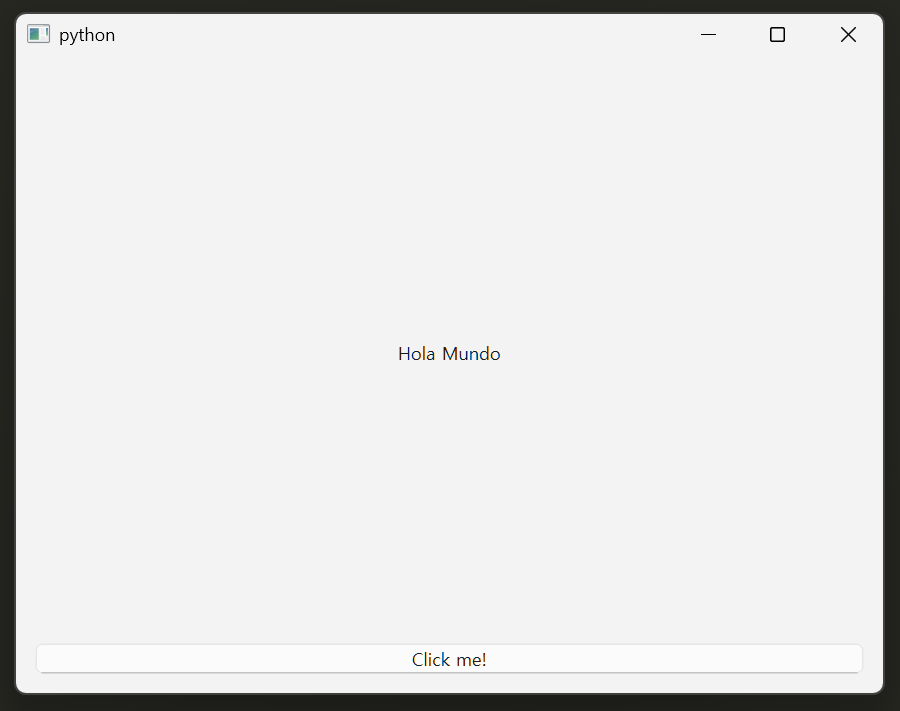

# helloworld

Qt for Python 홈페이지의 기본 예제

Your Qt for Python setup is ready. You can explore it further by developing a simple application that prints `"Hello World"` in several languages. The following instructions will guide you through the development process:

